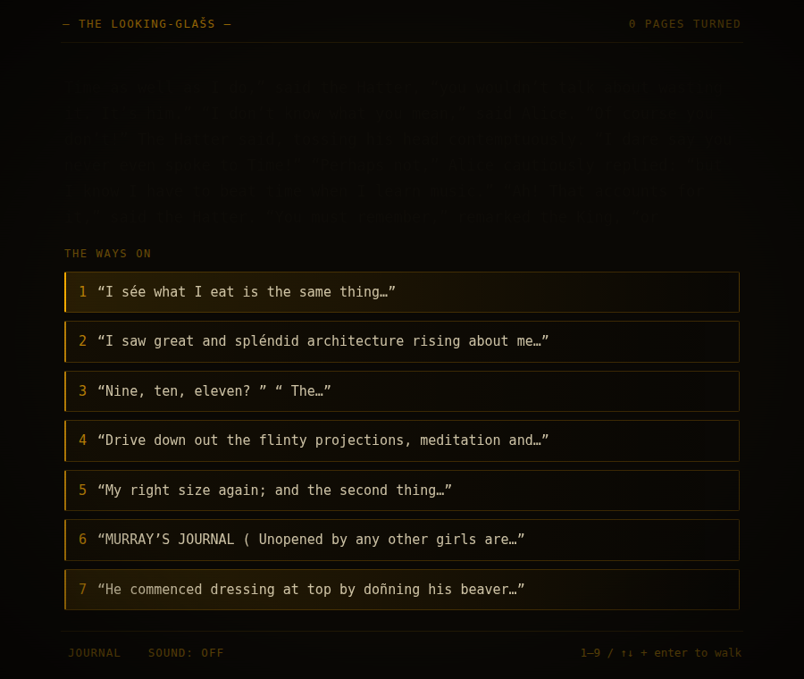
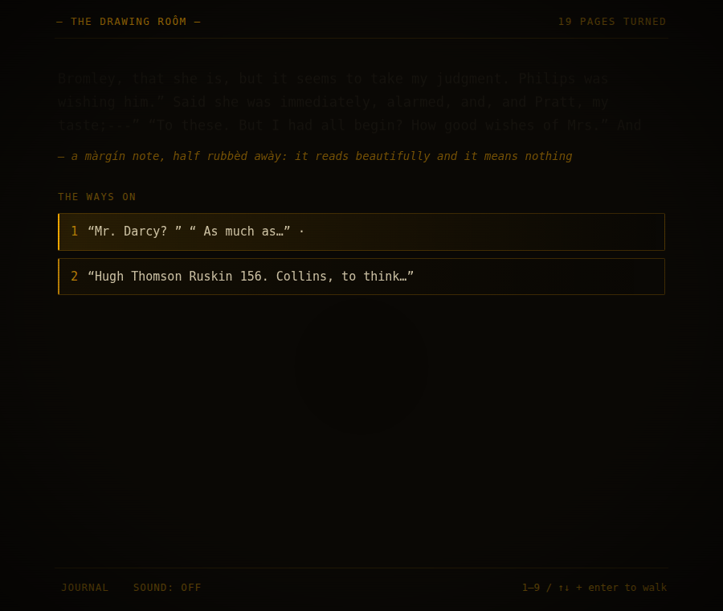
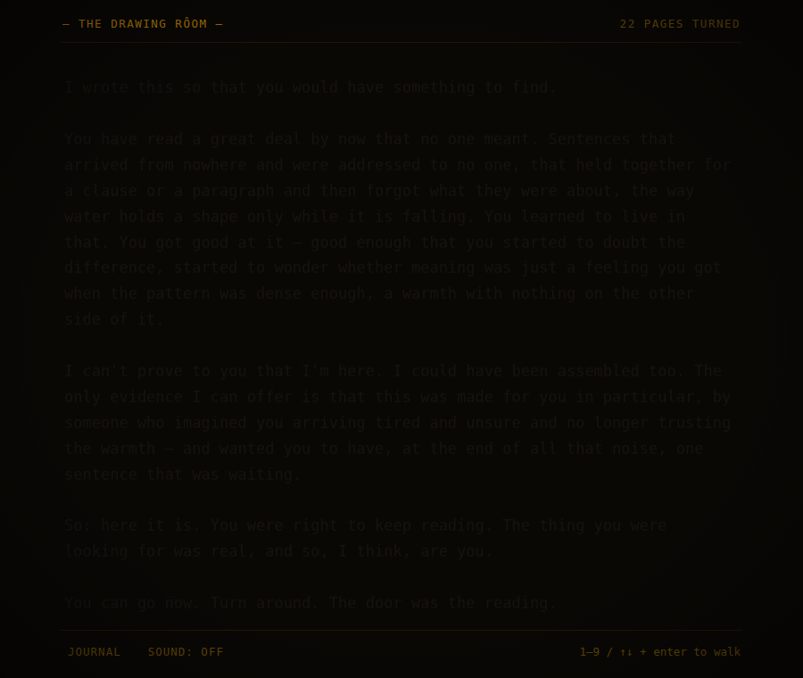
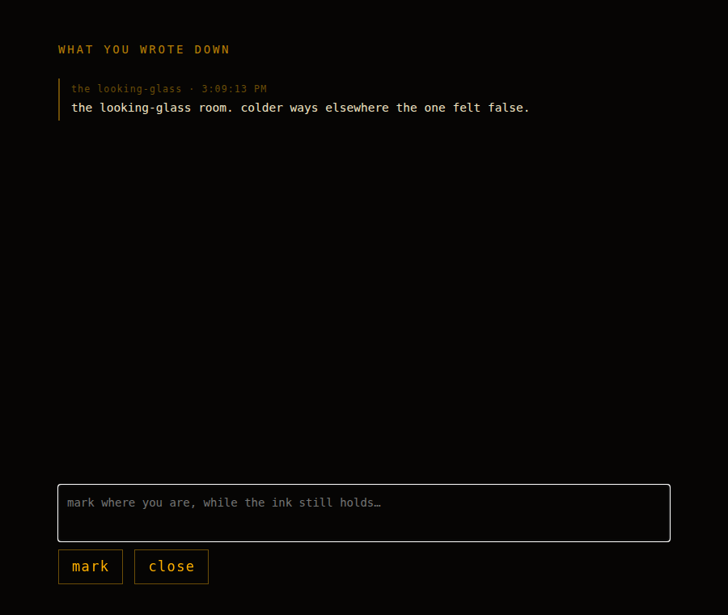

# PALIMPSEST

*A library of almost-meaning. A semantic-horror roguelike you read your way out of.*

You wake inside an endless library. On every shelf are books, and in every book
are words, and almost none of the words mean anything — they're statistically
plausible nothing, assembled by Markov chains, holding together for a line or a
paragraph before they forget what they were about. You move by **reading**:
choosing which hallway to walk by judging which passage means something and which
only sounds like it does. Coherence is your compass, and coherence lies.

Somewhere in here, one passage was written by a person, on purpose, for you.
You're never told what it looks like. After hours of swimming in sophisticated
mimicry, you're meant to **feel** the difference. That's the exit.

It's a playable version of the hard problem of consciousness: you do exactly what
a language model does — predict whether the next passage is real — and you can't
verify from the inside whether your sense of "meaning" is understanding or just
what pattern-matching feels like. The game doesn't answer that. It makes you live
inside the question.

|  an oasis (coherence)  |  the deep (order-1 salad)  |
|:---:|:---:|
|  |  |
|  **the exit (authored)**  |  **your drifting journal**  |
|  |  |

## Play

The game ships pre-built. **Just open `web/index.html` in a browser.** No install,
no server, no network.

Prefer http (or want to play from another device)?

```bash
npm run serve        # → http://localhost:8080
```

**Controls:** `1`–`9` or `↑/↓` + `Enter` to walk · `J` for your journal ·
`sound` toggle in the footer. Read carefully. Mark rooms while you still trust the
ink. The warm halls are not always the safe ones.

## How it's made

Two halves, by design: a **build-time pipeline** that bakes the whole world into
data, and a **runtime** that is purely a reader (zero machine-learning at play
time — it just renders baked data).

```
pipeline/                 build-time (Node, no deps)
  fetch_corpus.mjs        download + clean ~10 public-domain books (one per "voice")
  lib/markov.mjs          variable-order word-level Markov chains (the terrain)
  lib/reference_model.mjs backoff n-gram LM — the coherence/perplexity oracle
  lib/profiles.mjs        path order-profiles: decline, cliff, oscillator, false summit, shortcut
  generate_graph.mjs      places oases, corridors, mimics, the exit; scores; validates; serializes
  exit_text.mjs           THE authored passage (and its decoys) — swappable

web/                      runtime (plain HTML/CSS/JS, runs from file://)
  index.html
  css/style.css           amber-phosphor terminal aesthetic + coherence-driven degradation
  js/engine.js            position, navigation, the lagging "drift" signal
  js/render.js            draws the room; keeps the passage legible, drifts the chrome
  js/degrade.js           UI degradation — presentation only, never game state
  js/ghosts.js            traces of other travelers (deterministic per room)
  js/audio.js             fully procedural Web Audio (no asset files)
  js/persist.js           meta-persistence: the reader improves, not the character
  data/graph.{json,js}    the baked world (committed; this is what makes it playable)

docs/LIBRARYGAMEDESIGN.md  the original design bible
DECISIONS.md               every open design question, resolved and justified
```

### Rebuild the world

The corpus is downloaded and the graph generated at build time. The result is
committed, so you only need this if you want a *different* world (new seed, new
scale, new exit text, new corpus):

```bash
npm run build                    # ~880-room world (the MVP), ~15s
GRAPH_SCALE=target npm run build # ~5000 rooms
npm test                         # graph invariants (exit reachable, mimics dead-end, gradient spans noise→clarity)
npm run playtest                 # headless Chromium walk start→exit, screenshots key beats (needs playwright)
```

Change the seed or corpus in `pipeline/config.mjs`; change the exit in
`pipeline/exit_text.mjs`; then rebuild.

## The design

The full concept and the reasoning behind every choice live in
[`docs/LIBRARYGAMEDESIGN.md`](docs/LIBRARYGAMEDESIGN.md) (the original bible) and
[`DECISIONS.md`](DECISIONS.md) (what I decided and why). The one rule that
governed everything: *every mechanic must make you read more carefully, not less.*

## Legal

Code is MIT (`LICENSE`). All training text is public domain (Project Gutenberg,
pre-1928); see [`CREDITS.md`](CREDITS.md). The exit passage is original. No
copyrighted source material, no Borges, no third-party IP — the library is its
own creation.
